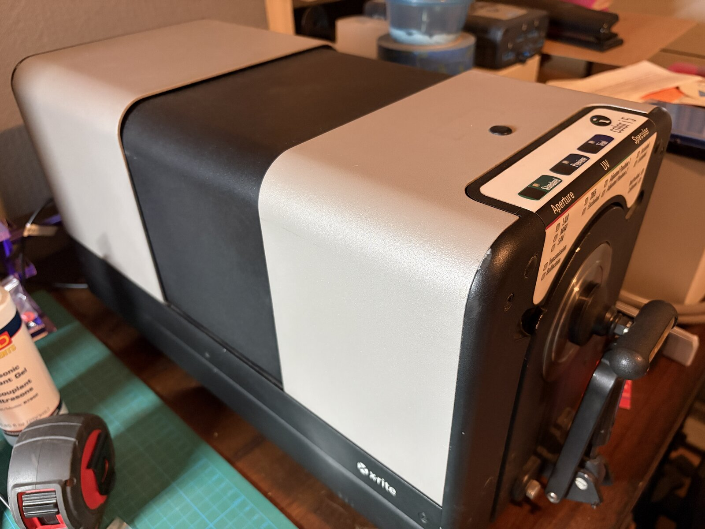
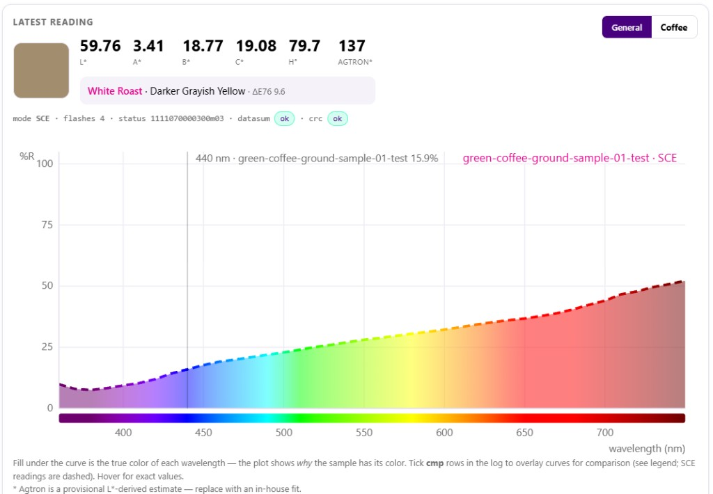

# x-rite-i5-tools

Open-source tools for the **X-Rite / GretagMacbeth Color i5** benchtop spectrophotometer —
drive it over its RS-232 port with plain Python. Built for measuring **coffee roast color**,
but the driver and protocol work for any reflectance measurement.

The Color i5 was a ~$20–30k industrial instrument (textiles, plastics, paint) that now turns
up used for a few hundred dollars. If you find yourself with one, the good news is it speaks
a friendly **plain-text ASCII protocol at 38400 8N1** — documented in
[docs/serial-protocol.md](docs/serial-protocol.md) — so a laptop and a USB-serial cable are
all it takes to put it to work.





## What's here

| Path | What it is |
|---|---|
| `i5_driver.py` | Standalone CLI driver: connect, calibrate, measure, recall, trigger, diagnostics, raw shell, offline pcap replay. Computes L\*a\*b\* (D65/10°) from the spectrum, verifies the instrument's CRC-32, classifies roast against the SCA universal color curve. Only dependency: `pyserial`. |
| `gui/` | Local-web GUI (Flask): live measurement, spectral plot with true-color fill and curve overlays, calibration flow, diagnostics tab, CSV log, optional cloud upload. |
| `cloud/` | Optional Cloudflare Worker + D1 backend so multiple benches can pool readings on one server, with per-user API keys (quotas, read-only, revocation). |
| `docs/serial-protocol.md` | The protocol itself — framing, full command set, the `fmeasure` response block, status-word decoding, the CRC-32 parameters. |
| `docs/firmware-help*.txt` | The instrument's own `help` output (it self-documents — 30 commands). |
| `data/sample-readings.csv` | Real readings (green coffee + a dark roast, full 360–750 nm spectra) so you can try the GUI with no hardware. |

## Hardware you need

- An X-Rite / GretagMacbeth **Color i5** (i5DV works the same over serial).
- Its **RS-232 port** + an **FTDI USB-serial cable** (`0403:6001` tested; others likely fine).
  Unplug the instrument's USB-B — the manual's "USB or RS-232, never both" is real.
- The **white calibration tile** and **black trap** for its port plate.

macOS has FTDI support built in (use the `/dev/cu.usbserial-*` device, not `tty.*`).
Windows may need the FTDI VCP driver; find your port with
`python -m serial.tools.list_ports -v`.

## Quick start (CLI)

```bash
pip install pyserial

python3 i5_driver.py info                  # connect + identify
python3 i5_driver.py cal                   # white tile, then black trap
python3 i5_driver.py measure --mode sce --label my-roast --csv readings.csv
```

## Quick start (GUI)

```bash
cd gui
pip install -r requirements.txt
python app.py                              # open http://127.0.0.1:5000
```

(macOS: AirPlay Receiver squats on port 5000 — use `python app.py --port 5001`.)

No instrument attached? Browse the sample data:

```bash
python app.py --load ../data/sample-readings.csv
```

## Coffee notes

- Measure ground coffee through the flat bottom of a glass dish, **SCE** mode, fixed grind
  and packing density — repack repeatability is ~±0.6 L\*.
- The Agtron number the tools print is a **provisional** L\*-derived estimate from published
  anchor points; it reads too light on dark/oily roasts. Treat it as directional until you
  fit your own regression against a reference device.

## Status / caveats

- Documented from wire captures of one Color i5 (firmware V2.23), then verified live: CRC
  checked against 12/12 captured measurements, and L\*a\*b\* matched the OEM software's reading
  of the same sample on the same instrument to ~0.1.
- Calibration, SCI/SCE, aperture/zoom and UV positions, trigger-by-front-panel-key, and
  diagnostics all work. Gloss and NetProfiler are untouched.
- The tools only send commands documented by the firmware's own `help` or observed in
  normal operation.

## Affiliation & provenance

This project is not affiliated with, endorsed by, or supported by X-Rite, Inc.
"X-Rite", "GretagMacbeth", "Color i5", and "NetProfiler" are trademarks of their
respective owners, used here only to identify the instrument. The protocol was
documented via wire capture — observing the instrument's own serial traffic — for
interoperability; no firmware was copied, extracted, or modified, and no
protection mechanism was circumvented.

## License

MIT — see [LICENSE](LICENSE).
